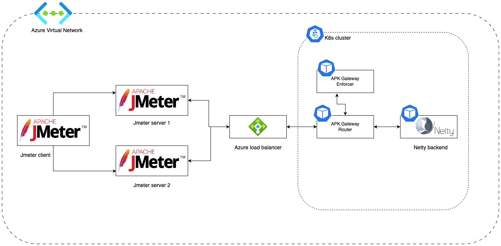

# Performance Test Results

The performance of APK was evaluated using an API that triggers a "Netty Echo Service" which echoes back any requests sent to it. The test cases utilized a secured API that directly invoked the backend via APK gateway.

Tests were conducted to assess the performance of APK with varying concurrent user loads of 10, 50, 100, 200, 500, and 1000 users, where concurrent users refer to multiple users accessing APK simultaneously. Different message sizes (payloads) of 50B, 1KiB, 10KiB, and 100KiB were used in the tests. The back-end delay was 0ms, and Apache JMeter was used as the test client. The test scenarios were executed over a 20-minute timeframe, which included a 5-minute warmup period. Test results were analyzed by excluding outcomes relevant to the warmup period.

Two key performance metrics were used to measure the performance of each test.

- Throughput: The number of requests that the Choreo Connect processes during a specific time interval (e.g. per second).
- Response Time : The end-to-end latency for an operation of invoking a service in Choreo Connect. The complete distribution of response times was recorded.

## Deployment used for the performance tests

Given below are the details of the deployment that was used for the performance test that is recorded in this documentation.

!!! important
    For better throughput and performance, it is recommended to use compute optimized nodes for the cluster and the Jmeter servers.

<table>
<thead>
  <tr>
    <th>Name</th>
    <th>Azure VM Instance Type</th>
    <th>vCPU</th>
    <th>Mem(GiB)</th>
  </tr>
</thead>
<tbody>
  <tr>
    <td>Apache JMeter Client</td>
    <td>Standard F8s v2</td>
    <td>8</td>
    <td>16</td>
  </tr>
  <tr>
    <td>Apache JMeter Server 01</td>
    <td>Standard F8s v2</td>
    <td>8</td>
    <td>16</td>
  </tr>
  <tr>
    <td>Apache JMeter Server 02</td>
    <td>Standard F8s v2</td>
    <td>8</td>
    <td>16</td>
  </tr>
  <tr>
    <td>AKS cluster (two node pools)</td>
    <td>Standard F8s v2</td>
    <td>8</td>
    <td>16</td>
  </tr>
</tbody>
</table>

- The operating system used for the Jmeter servers and the client in Ubuntu 20.04 LTS
- Java version used for tests is OpenJDK Runtime Environment (Temurin)(build 1.8.0_362-b09)
