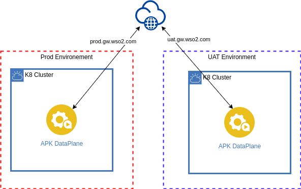
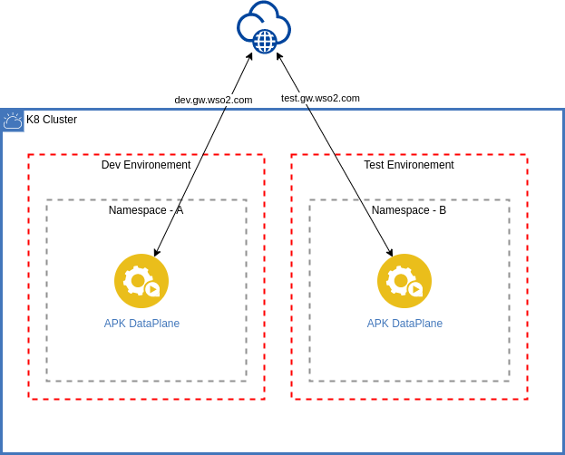

# APK Deployment Patterns

This document outlines the recommended deployment patterns for the WSO2 APK. There are two primary deployment patterns for APK

* Dataplane per kubernetes cluster
* Dataplane per kubernetes namespace


## Dataplane per kubernetes cluster

### Overview

In this approach, each environment (dev, prod, etc..) has its own dedicated Kubernetes cluster hosting an instance of the APK dataplane. In this pattern APK dataplane will have visibility over all the namespace (or a predefined set of namespaces) in the cluster.

### Architecture diagram

[](../assets/img/deployment-patterns/APK_Dataplane_per_Cluster.png)

### Advantages

* Isolation: Each environment operates in its own dedicated cluster, providing the highest level of isolation and minimizing the risk of interference between environments.
* Security: With separate clusters, it's easier to implement stringent security policies specific to each environment.
* Performance Predictability: Resources are exclusively allocated to each cluster, guaranteeing consistent performance levels.

### Considerations

* Resource Utilization: This approach may require additional resources due to the need for separate clusters for each environment.
* Administrative Overhead: Managing multiple clusters can be more complex and may require additional administrative effort.


### Deployment guideline

By default, WSO2 APK is configured to support the Dataplane per cluster pattern. You can use the provided helm chart without any modifications for this pattern. 

If you wish to change the default hostname and vhost change the following values.yaml configurations. Lets say you want to deploy a production environment and you have a domain name example.com and you want to expose your API's through prod.gw.example.com and expose APK system APIs through prod.apk.example.com then

- wso2.apk.listener.hostname: 'prod.apk.example.com'
- wso2.apk.dp.gateway.listener.hostname: 'gw.example.com'
- wso2.apk.dp.configdeployer.vhosts: [{"hosts":["gw.example.com"],"name":"prod","type":"production"}]


If you wish to specify a predefined set of namespaces for monitoring, you can configure the `wso2.apk.dp.adapter.configs.apiNamespaces` variable in the `values.yaml` file. For example, if you want the dataplane to monitor only the `ns-1` and `ns-2` namespaces, you can set it as follows:

```yaml
Wso2:
	apk:
		dp:
			adapter:
        configs:
          apiNamespaces:
            - "ns-1"
            - "ns-2”
      commonController:
        configs:
          apiNamespaces:
            - "ns-1"
            - "ns-1"
```

This approach is recommended for Production and UAT environments


## Dataplane per Kubernetes Namespace

### Overview

In this approach, multiple environments (dev, prod, etc..) share the same Kubernetes cluster. Each environment has its own dedicated namespace containing the APK dataplane.

### Architecture diagram

[](../assets/img/deployment-patterns/APK_Dataplane_per_NS.png)

### Advantages

* Resource Efficiency: This pattern maximizes resource utilization by allowing multiple environments to coexist within the same cluster.
* Simplified Management: Managing a single cluster with multiple namespaces can be more straightforward compared to managing separate clusters.

### Considerations
* Isolation: While namespaces provide a level of isolation, they may not offer the same level of isolation as separate clusters. Careful resource allocation and RBAC (Role-Based Access Control) policies are essential.

### Deployment guideline

Inorder to deploy APK as Dataplane per namespace pattern you need to change some values.yaml file configurations. Let’s say you want to deploy APK for Dev environment and you need to deploy it on namespace named `development` then update the values.yaml file as follows

```yaml
Wso2:
	apk:
		dp:
			adapter:
        configs:
          apiNamespaces:
            - "development"
      commonController:
        configs:
          apiNamespaces:
            - "development"
```

You need to change the default hostname and vhost. Change the following values.yaml configurations. Lets say you want to deploy a development environment and you have a domain name example.com and you want to expose your API's through dev.gw.example.com and expose APK system APIs through dev.apk.example.com then

- wso2.apk.listener.hostname: 'dev.apk.example.com'
- wso2.apk.dp.gateway.listener.hostname: 'dev.gw.example.com'
- wso2.apk.dp.configdeployer.vhosts: [{"hosts":["gw.example.com"],"name":"dev","type":"production"}]


This approach is recommended for maintaining Dev, Test environments. 
