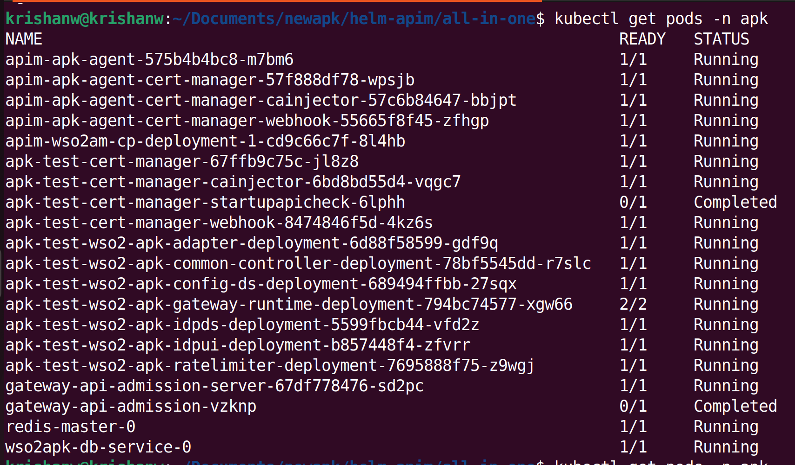

Follow the instructions below to deploy APK Data Service (DS) servers and the Cloud Native Postgres(CloudNativePG) in the Kubernetes cluster.

### Create Kubernetes namespace

``` 
kubectl create ns apk
```


### Setup WSO2 API Manager Control Plane 4.3.0

Setup WSO2 API Manager 4.3.0 in K8s cluster using Helm Charts.

1. Create a new helm repository with the latest apim release using the following command. Let’s consider the ```<repository-name>``` as ```wso2apim```.

    ```console
    helm repo add wso2apim-rc https://github.com/wso2/helm-apim/releases/download/cp-4.3.0-rc
    ```

2. Execute the following command to update the helm repositories.

    ```console
    helm repo update
    ```

3. Consider ```apim``` as the ```<chart-name>``` for this guide. As the ```--version``` of this command, use the version of the release you used in point 1 above. It will take a few minutes for the deployment to complete.

    === "Mac Command"
        ```
        helm install apim wso2apim-rc/wso2am-cp --version 4.3.0-rc -f https://raw.githubusercontent.com/wso2/apk/main/helm-charts/samples/apim/cp/apk-cp/arm-values.yaml -n apk
        ```
    === "AMD Command"
        ```
        helm install apim wso2apim-rc/wso2am-cp --version 4.3.0-rc -f https://raw.githubusercontent.com/wso2/apk/main/helm-charts/samples/apim/cp/apk-cp/amd-values.yaml -n apk
        ```
    === "Format"
        ```
        helm install <chart-name> <repository-name>/wso2am-cp --version <verison-of-APIM> -f <path-to-values.yaml-file>
        ```

4. Install NGINX Ingress Controller using the following command. Please refer to the [NGINX Ingress Controller](https://kubernetes.github.io/ingress-nginx/deploy/#local-development-clusters) documentation for more information.


### Setup WSO2 APK Dataplane 1.1.0

1. Create a new helm repository with the latest apk release using the following command. Let’s consider the ```<repository-name>``` as ```wso2apk```.

    ```console
    helm repo add wso2apk-rc https://github.com/wso2/apk/releases/download/1.1.0-rc
    ```

2. Execute the following command to update the helm repositories.

    ```console
    helm repo update
    ```
   
3. Install the APK components and start WSO2 API Platform For Kubernetes. Consider ```apk``` as the ```<chart-name>``` for this guide. As the ```--version``` of this command, use the version of the release you used in point 1 above. It will take a few minutes for the deployment to complete.

    === "Command"
        ```
        helm install apk wso2apk-rc/apk-helm --version 1.1.0-rc -f https://raw.githubusercontent.com/wso2/apk/main/helm-charts/samples/apk/values.yaml -n apk
        ``` 
    === "Format"
        ```
        helm install <chart-name> <repository-name>/apk-helm --version <verison-of-APK> -f <path-to-values.yaml-file>
        ```


### Setup WSO2 APIM-APK Agent 1.1.0

1. Create a new helm repository with the latest apim apk agent release using the following command. Let’s consider the ```<repository-name>``` as ```wso2apkagent``` for this guide.

    ```console
    helm repo add wso2apkagent-rc https://github.com/wso2/product-apim-tooling/releases/download/1.1.0-rc
    ```

2. Execute the following command to update the helm repositories.

    ```console
    helm repo update
    ```

3. Install the APIM APK Agent components and start WSO2 API Platform For Kubernetes. Consider ```apk``` as the ```<chart-name>``` for this guide. As the ```--version``` of this command, use the version of the release you used in point 1 above. It will take a few minutes for the deployment to complete.

    === "Command"
        ```
        helm install apim-apk-agent wso2apkagent-rc/apim-apk-agent --version 1.1.0-rc -f https://raw.githubusercontent.com/wso2/apk/main/helm-charts/samples/apim-apk-agent/cp/values.yaml -n apk
        ```
    === "Format"
        ```
        helm install <chart-name> <repository-name>/apim-apk-agent --version <verison-of-APK-Agent> -f <path-to-values.yaml-file>
        ```


### Verify the deployment

Now you can verify the deployment by executing the following command. You will see the status of the pods of APK dataplane and APIM Control plane as follows once completed.

=== "Command"
    ```
    kubectl get pods
    ```
    [](../assets/img/get-started/cp-podstatus.png)