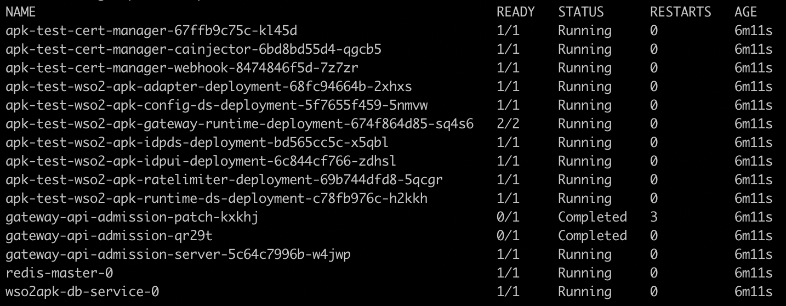

Follow the instructions below to deploy APK Data Service (DS) servers and the Cloud Native Postgres(CloudNativePG) in the Kubernetes cluster.

1. Create a new helm repository with the latest apk release using the following command. Let’s consider the ```<repository-name>``` as ```wso2apk``` for this guide.

	=== "Command"
		```
		helm repo add wso2apk https://github.com/wso2/apk/releases/download/1.0.0-rc
		```
	=== "Format"
		```
		helm repo add <repository-name> <link-to-latest-apk-release>
		```
	
2. Execute the following command to update the helm repositories.

      ```console
      helm repo update
      ```

3.  Create a namespace in kubernetes if you have not done so already with prerequisites above. Consider the ```<namespace>``` as ```apk``` for this guide.
	
	=== "Command"
		```
		kubectl create namespace apk
		```

	=== "Format"
		```
		kubectl create namespace <namespace>
		```

4. Install the APK components and start WSO2 API Platform For Kubernetes. Consider ```apk``` as the ```<chart-name>``` for this guide. As the ```--version``` of this command, use the version of the release you used in point 1 above. It will take a few minutes for the deployment to complete.

	=== "Command"
		```
		helm install apk wso2apk/apk-helm --version 1.0.0-rc -n apk
		```

	=== "Format"
		```
		helm install <chart-name> <repository-name>/apk-helm --version <verison-of-APK> -n <namespace>
		```
	
	To commence the installation while making use of the customization capabilities inherent in the `values.yaml` file, follow the subsequent command format. Instructions in [Customize Configurations](../setup/Customize-Configurations.md) will guide you through the process of acquiring the `values.yaml` file.

	=== "Command"
		```
		helm install apk wso2apk/apk-helm --version 1.0.0-rc -f values.yaml -n apk
		```

	=== "Format"
		```
		helm install <chart-name> <repository-name>/apk-helm --version <verison-of-APK> -f <path-to-values.yaml-file> -n <namespace>
		```

5.  Now you can verify the deployment by executing the following command. You will see the status of the pods as follows once completed.

    === "Command"
        ```
        kubectl get pods -n apk
        ```

    === "Format"
        ```
        kubectl get pods -n <namespace>
        ```

    [](../assets/img/get-started/pod-status.png)


!!! info "(Optional) To access the deployment through your local machine"

    1. Identify the `gateway-service` external IP address.
        ```console
        kubectl get svc -n apk | grep gateway-service
        ```
    2. Port forward router service to localhost.
        ```console
        kubectl port-forward svc/apk-wso2-apk-gateway-service -n apk 9095:9095
        ```
