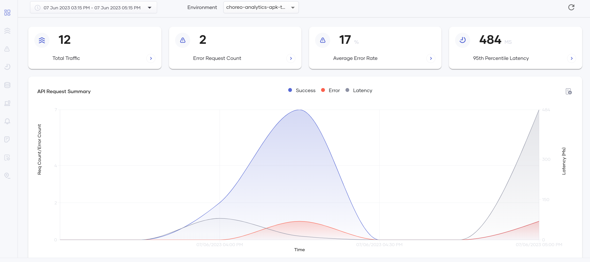
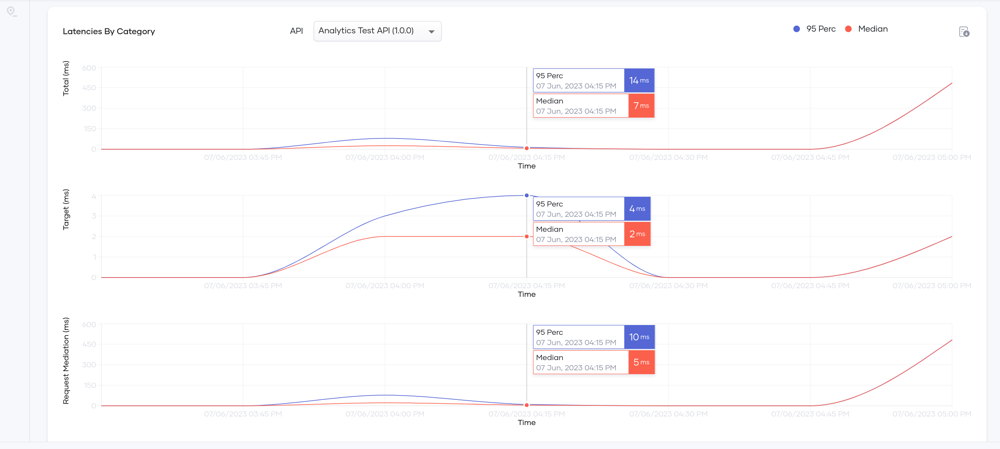

# Configure Analytics for Choreo Insights

## Step 1 - Generate On-prem Key

1. Sign in to [Choreo](https://console.choreo.dev/login/).

2. Go to `Settings > On-prem Keys` and click on `Generate Key` button.

3. Copy the generated on-prem key.


## Step 2 - Configure APK

1. Create a secret containing the Choreo Auth URL and the Choreo token using the following command. Replace the ```choreo-on-prem-key``` value with your on-prem key generated in Step 1.

    === "Sample Command"
        ```bash
        kubectl create secret generic choreo-analytics-secret --from-literal=authToken='<choreo-on-prem-key>' --from-literal=authURL='https://analytics-event-auth.choreo.dev/auth/v1' -n apk
        ```
    === "Command Format"
        ```bash
        kubectl create secret generic <secret-name> --from-literal=authToken='<choreo-on-prem-key>' --from-literal=authURL='https://analytics-event-auth.choreo.dev/auth/v1' -n <namespace>
        ```

2. Follow the instructions outlined in [Customize Configurations](../Customize-Configurations.md). These instructions will guide you through the process of acquiring the `values.yaml` file, which you will then use to tailor the analytics configurations to your specific needs. 
3. Replace ```secret-name``` in the following configuration with the name of the secret you created in the previous step.
```yaml
analytics:
 enabled: true
 publishers:
 - enabled: true
   type: "default"
   secretName: <secret-name>
```

4. Open the `values.yaml` file, and add the above configuration to the gatewayRuntime section under dp. Your values.yaml file should have a structure as follows.
```yaml
wso2:
  ...
  apk:
    ...
    dp:
      ...
      gatewayRuntime:
        analytics:
          enabled: true
          publishers:
          - enabled: true
            type: "default"
            secretName: <secret-name>
```
Then redeploy the helm chart with the changes in `values.yaml`.

### Optional - Adding Multiple Publishers

You can also set multiple publishers for analytics as follows. Replace ```choreo-secret-name``` and ```moesif-secret-name``` with the appropriate values.

```yaml
gatewayRuntime:
  analytics:
    enabled: true
    publishers:
      - enabled: true
        type: "default"
        secretName: <choreo-secret-name>
      - enabled: true
        type: "elk"
      - enabled: true
        type: "moesif"
        secretName: <moesif-secret-name>
```

## Step 3 - View Analytics Data

1. After setting up the enforcer, invoke a few requests (success and failure) for a deployed API.

2. Go to [Choreo Insights](https://console.choreo.dev/insights) and select the correct environment to view the analytics data.

Following are some of the graphs generated in the Choreo Insights.

[](../../assets/img/analytics/choreo-insights-overview.png)

[](../../assets/img/analytics/choreo-insights-latency.png)


