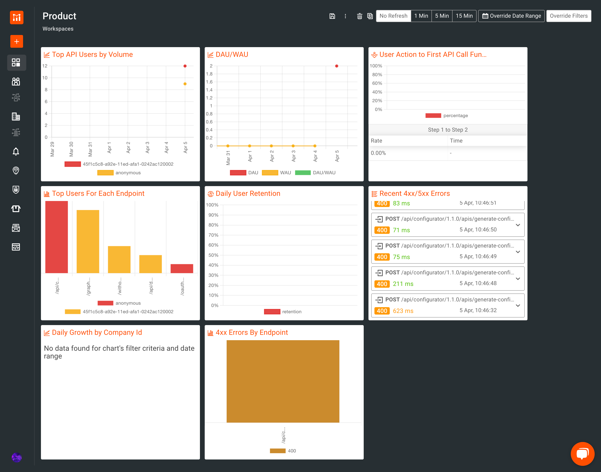

# Configure Analytics for Moesif

## Step 1 - Get Collector Application Id

1. Sign up for [Moesif](https://www.moesif.com/).

2. During the sign up process, you will receive a Collector Application Id for your configured application. Copy this value and keep it saved.

## Step 2 - Configure APK

1. Create a secret containing the Moesif Collector Application ID using the following command. Replace the <moesif-collector-application-id> will your Collector Application ID.

=== "Sample Command"
     ```bash
     kubectl create secret generic moesif-secret --from-literal=moesifToken='<moesif-collector-application-id>' -n apk
     ```
=== "Command Format"
     ```bash
     kubectl create secret generic <secret-name> --from-literal=moesifToken='<moesif-collector-application-id>' -n <namespace>
     ```

1. Follow the instructions outlined in [Customize Configurations](../Customize-Configurations.md). These instructions will guide you through the process of acquiring the `values.yaml` file, which you will then use to tailor the analytics configurations to your specific needs. Open the `values.yaml` file. Set the following config under `wso2.apk.dp.gatewayRuntime` section and apply helm chart.

Replace <secret-name> with the name of the secret containing the moesif token you created in the previous step.

    ```yaml
    analytics:
      enabled: true
      publishers:
      - enabled: true
        type: "moesif"
        secretName: <secret-name>
    ```

You can also set multiple publishers for analytics as follows.
    ```yaml
    analytics:
      enabled: true
      publishers:
        - enabled: true
          type: "default"
          secretName: <choreo-secret-name>
        - enabled: true
          type: "elk"
        - enabled: true
          type: "moesif"
          secretName: <moesif-secret-name>
    ```

## Step 3 - View Analytics Data

1. After setting up the enforcer, invoke a few requests (success and failure) for a deployed API.

2. Go to your Moesif dashboard and you will be able to view your analytics reports.

The following is an overview of the graphs generated in the Moesif Dashboards.

[](../../assets/img/analytics/moesif-dashboards-overview.png)


